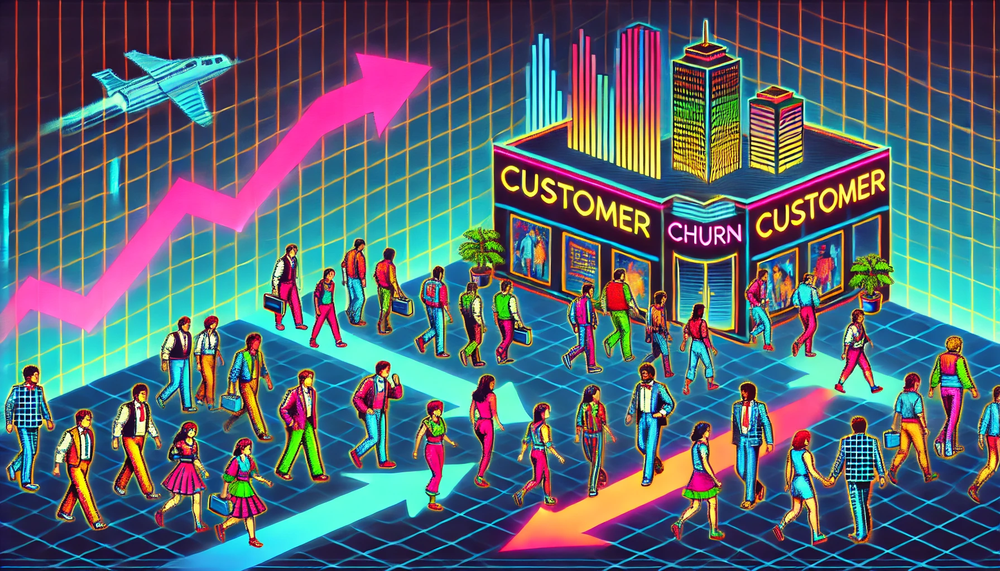

# Customer Churn Prediction

This project aims to predict and analyse customer churn using various machine learning algorithms. Customer churn, or customer attrition, is when customers stop doing business with a company. Predicting churn helps businesses take proactive steps to retain customers and enhance revenue.



## Project Structure

Customer_Churn_Predictive_Analytics/
```bash
.
│
├── Customer_churn_prediction.html            # Static HTML version of the notebook with Plotly plots rendered as SVG
├── Customer_churn_prediction.ipynb            # Jupyter notebook with Plotly plots rendered as SVG
├── Customer_churn_prediction_NBviewer.ipynb   # Jupyter notebook with interactive Plotly plots for nbviewer
├── WA_Fn-UseC_-Telco-Customer-Churn.csv       # Dataset used for the analysis
├── customer_churn.png                         # Example plot image used in the analysis
└── README.md                                  # Project documentation (this file)
```


## Notebooks

### 1. Customer_churn_prediction.ipynb

This notebook contains the entire analysis with Plotly plots rendered as SVG. It is designed for static viewing without requiring interactive plot capabilities.

### 2. Customer_churn_prediction_NBviewer.ipynb

This notebook includes interactive Plotly plots, which can be viewed using nbviewer. It provides an enhanced, interactive experience for exploring the data and analysis.

You can view the interactive notebook directly [Click Me for Interactive Fun!](https://nbviewer.org/github/yangsong24/Customer_Churn_Predictive_Analytics/blob/main/Customer_churn_prediction_NBviewer.ipynb).


## Dataset

The dataset used for this analysis is `WA_Fn-UseC_-Telco-Customer-Churn.csv`, which includes various features related to customer demographics, account information, and services subscribed to by the customer.

## Exploratory Data Analysis (EDA)

The EDA section includes:

1. **Distribution of Churn**:
    - Shows the imbalance between churn and non-churn instances.

2. **Churn Distribution Across Contract Types**:
    - Highlights churn rates for different contract types.

  3. **Churn Distribution Across Tenure**:
    - Analyzes churn rates based on the customer Tenure.

4. **Churn Distribution Across Paperless Billing**:
    - Examines churn rates for customers using paperless billing.

## Feature Importance

The feature importance analysis identifies the most influential features for predicting churn using logistic regression. Key features include tenure, contract type, Internet service type, total charges, and monthly charges.

## Machine Learning Models

Several machine learning models were tested to predict customer churn, including:

- Logistic Regression
- Support Vector Machine (SVM)
- Decision Trees
- Random Forest
- XGBoost
- CatBoost
- AdaBoost

Each model's performance was evaluated using F1 Score and Accuracy metrics.

## Results

The logistic regression model with appropriate hyperparameter tuning provided the best balance of precision and recall for predicting customer churn in this dataset.

## Conclusion

This project demonstrates the use of various machine learning models to predict customer churn. Future work could involve exploring deeper hyperparameter tuning, feature engineering, or more sophisticated models to improve performance further.

## Running the Notebooks
Launch the notebook in jupyter notebook.


